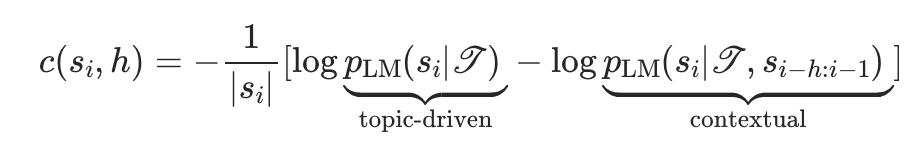

# Sequentiality

## Installing Dependencies
Paste `pip install -r requirements.txt` into the command line in the root of directory.

Then go to https://pytorch.org/get-started/locally/ to install the right version of PyTorch.

## Description

### `sequentiality.py`
At a high level, the sequentiality model first takes in a given text (`SequentialityModel.calculate_text_sequentiality`). Then it creates a list of sentences (it uses a regualar expression to split the text by sentence). For each sentence, both the topic and contextual sequentiality are calculated (`SequentialityModel._calculate_topic_sequentiality` and `SequentialityModel._calculate_contextual_sequentiality` respectively). 

For each call of `SequentialityModel.calculate_text_sequentiality`, the topic is set dynamically using `SequentialityModel.set_topic`. More specifically, prompt engineering is used to instruct the model to condition every word of the following text on a particular topic. 

The equation for the sequentiality value of a sentence: 

The sequentiality values for each sentence of a story are then averaged to get the value for the whole text (in accordance with the paper) in the method `SequentialityModel.calculate_text_sequentiality` on line `276`. 

When it's finished running `SequentialityModel.calculate_text_sequentiality` returns a tuple containing the scalar sequentiality value for the entire text, as well as lists of topic, contextual and total sequentialities for every sentence in the text. 

### `main.py`
To run the code, run use `python3 main.py` and change the function at the bottom of the file. The function that was used to generate data was `run_sequential` (definition on line `357` of `main.py`). Calling `generate_plots` in `main.py` will generate Figure 2a and 2d. 

`generate_mini_files` is a function that when given a subset of `hcV3-stories` will section the calculated values for every history length for a given model and create other files that only include values that are in the subset of `hcV3-stories`. For example, I can create a subset of `hcV3-stories` that only includes stories about cats. From here, since I've already calculated all the values for all history lengths in the dataset, I just need to find the subset of the calculated values where the AssignmentId's match all of the ones in the subset that talks about cats. This allows me to divide the data in different ways without having to recalculate sequentiality values for the subset.

## Data
The dataset used in the original paper ([Hippocorpus](https://huggingface.co/datasets/allenai/hippocorpus)), is in `datasets/hcV3-stories.csv`. Also in `datasets/` are a bunch of subsets of the whole dataset, such as the one used for Llama-70b on HPC3. 

The calculated sequentiality values are stored in `outputs/` and are organized by model (each sub-folder is named after its corresponding model). Within each model folder, there are 9 folders that are numbered according to the history length that was used to calculate the values in that folder. `main.csv` is the file that contains all of the sequentiality values for the entire dataset, and the other files are subsets of `main.csv` (`main-mini.csv` was used to generate the plots).

